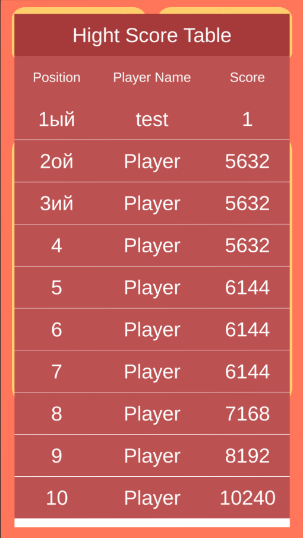

#2048
Данный проект представляет собой реализацию игры "2048".
В поле 4*4 генерируются 2 заполненые ячейки, с вероятностью 90% - 2, и с 10% - 4. Во время хода игрока ячейки с одинаковым номиналом объединяются, после чего в свободных ячейках происходит генерация новых значений. Номиналы 2 и 4 выделены тёмными цветами по задумке игры, остальные - белыми. Цвет ячеек меняется вместе с номиналом ячейки. 
- При достижении значения ячейки в 2048 считается, что игрок победил.
- Если никакие ячейки не могут объединиться и нельзя сгенерировать новые, то игрок проиграл.

Дополнительные возможности:
- Подсчёт очков, набранных пользователем, а также лучший результат. (Лучшим считается результат, при котором пользователь достигает победы, совершив наименьшее число ходов, т.е набрав наименьшее число очков)
- Возможность перезапуска уровня в любой момент игры.
- Возможность смены размерности поля от 3 до 10.
- Локальная таблица рекордов.

    
    
Процесс игры и основной интерфейс

    
    
Локальная таблица рекордов пользователя

